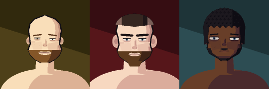

# Named portrait corrections — 6 September 2026

Source changes only; no executable or portable package has been rebuilt.

## Reviewed direction

- **Markell Holmes**: user-directed dark skin, black afro and black chinstrap beard.
- **Brett Akey**: user-directed bald scalp. His other generated features are retained.
- **Conor McGregor**: short faded dark-brown hair, a warmer brown full beard, pale
  skin, dark brows and authored facial proportions. This is based on the inspected
  [UFC July 2021 profile photograph](https://www.ufc.com/images/styles/athlete_bio_full_body/s3/2021-07/MCGREGOR_CONOR_L_07-10.png?itok=XnPDXUuN),
  not a claim about his current September 2026 haircut.

Conor's portrait remains a stylised, angular approximation. The shared renderer
does not reproduce his tattoos or provide a photographic likeness. The contact
sheet was visually reviewed; skin/hair/beard direction is clearer, but detailed
likeness remains limited by the renderer.

Reviewed at 72, 98, 104 and 180 pixels using the shared runtime rasteriser. The
smaller sheets are `analysis/portraits/named_corrections_72.png`,
`named_corrections_98.png` and `named_corrections_104.png`; they confirm silhouette
and colour direction at actual render sizes, not a complete in-screen UI audit.



## Compatibility

The existing named-override merge applies these corrections after stored identity
values without rewriting the save. A before/after comparison against the previous
commit confirms exactly these three effective identities change among all 1,534
shipped fighters. Generation, country priors and all existing style IDs are unchanged.

The optional `beard_colour` key is an append-only HAIR palette index. It is not a
new random draw: absent values retain the old beard/scalp colour relationship and
historical pixels. Authored beard colours receive the existing age-greying mix.
They affect neither clean-shaven portraits nor women's portraits. Cache keys already
include the complete effective identity, so authored colours invalidate cached images.

## Reproduce the review

```powershell
py -3 analysis/portraits/generate_portrait_contact_sheet.py --name "Markell Holmes" --name "Brett Akey" --name "Conor McGregor" --count 3 --columns 3 --cell 180 --out analysis/portraits/named_corrections_2026_09.png --manifest analysis/portraits/named_corrections_2026_09.json
py -3 fighter_portrait_regression_test.py
py -3 smoke_test.py
py -3 fighter_profile_regression_test.py
py -3 run_regression_suite.py
```

Regressions cover exact named controls despite stale stored choices, non-mutating
save behaviour, separate beard-colour rendering, female/clean-shaven guards,
save round trips, historical render fingerprints and full-bout/RNG cosmetic parity.
The shipped identity manifest is intentionally refreshed for these three corrections.

Verification on 6 September 2026: all 39 portrait tests and all nine profile tests
passed. Standalone smoke passed, with the display-layout-dependent matchmaking
click-selection probe skipped. The isolated shipping runner also passed both
3,840-fight baselines: the engine comparison reported `failures: []`, and the
19-action comparison reported `passed: true`.
The complete `run_regression_suite.py` then exited 0 with all requested isolated
suites passed, including all six native release suites and the final three-seed
stability playtest. No regression gates or simulation code were changed here.
